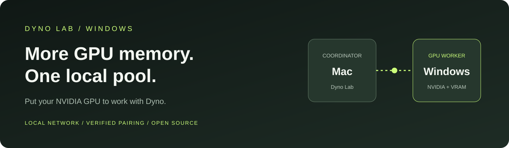
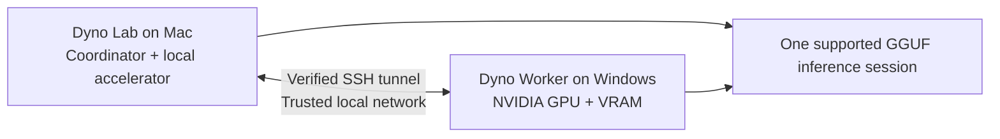

<p align="center">
  <a href="https://github.com/canivel/dynolab"></a>
</p>

<h1 align="center">Dyno Lab · Windows Worker</h1>
<p align="center"><strong>Bring your NVIDIA GPU into your Dyno Lab pool.</strong></p>

<p align="center">
  <a href="https://github.com/canivel/dynolab-windows-client/actions/workflows/ci.yml"></a>
  <a href="LICENSE"></a>
  
  
  
</p>

<p align="center">
  <a href="https://github.com/canivel/dynolab"><strong>Dyno Lab for Mac</strong></a> ·
  <a href="https://dynolab.dev">Website</a> ·
  <a href="worker/windows/README.md">Windows setup</a> ·
  <a href="docs/telemetry.md">Telemetry protocol</a> ·
  <a href="CONTRIBUTING.md">Contribute</a>
</p>

Your Windows PC can contribute more than a second screen. **Add its NVIDIA GPU and VRAM to a local Dyno Lab inference pool**, giving supported GGUF models access to accelerator memory across your Mac and Windows PC.

[Dyno Lab](https://github.com/canivel/dynolab) is a native Mac workbench for local inference and AI safety, alignment, and interpretability research. This companion runs the Windows GPU worker: discover it on your home or office network, pair it with Dyno, and let the coordinator distribute supported inference work.

## Expand the GPU memory available to your pool

A model that is too large for one device may fit when its supported backend allocations are distributed across devices. Dyno's pool connects the Mac coordinator to the Windows GPU over your local network.



**This expands the pool's usable GPU memory footprint; it does not turn separate devices into one physically shared memory bank.** Model weights, KV cache, backend overhead, other applications and network speed all affect what fits and how fast it runs. Adding device memory totals is not a fit guarantee or a promise of faster generation. The pool uses a separate GGUF backend; it does not reuse already-loaded MLX weights or automatically distribute every Lab research tool.

The current development path validates **one Mac coordinator with one Windows NVIDIA worker first**. Multiple workers and multiple simultaneous clients need further validation before they can be promised as supported configurations.

## Connect your GPU

1. **Run the worker on Windows.** Use a maintainer-built preview or [build from source](#build-and-test). Extract the entire app folder and open `DynoWorker.exe`.
2. **Choose your local network.** Both computers must be on the same trusted LAN. Select it in the worker and enable discovery. A matching Wi-Fi name alone does not guarantee a shared subnet.
3. **Pair in Dyno Lab.** Open a five-minute pairing window on Windows. In the compatible Mac app's **Pools → Nearby workers**, find the PC and compare the verification codes on both screens. Approve local Windows setup when requested.
4. **Start the Windows worker.** Select your GPU and click **Start worker**. `Listening` means the RPC service is ready; a model has not necessarily been loaded.
5. **Test and start the pool on Mac.** Choose a small GGUF model, run **Test devices**, then start the pool and try a short generation.

For existing pairings, **Enable telemetry for paired coordinator** adds access to GPU metrics without replacing the saved identity or host key. Reconnect the coordinator's tunnel after the upgrade.

This is a **source/development preview**, not a general signed Windows release. A compatible development build of Dyno Lab with Pools support is required. The maintainer's current hardware target is the RTX 5090; other CUDA architectures require appropriate builds and testing. End-user preview packages include Python and CUDA runtime libraries; building them requires the toolchain below.

## See what your GPU is doing

| In the worker | What it tells you |
| --- | --- |
| **GPU status** | Selected accelerator, driver, VRAM, load and temperature. |
| **Worker lifecycle** | Whether the owned RPC process is stopped, listening or failed. |
| **Connection setup** | Network selection, discovery, pairing and progress inside the app. |
| **Activity log** | Searchable, bounded runtime messages and diagnostic export. |
| **Local telemetry** | Cached utilization, VRAM, temperature and supported power readings for a compatible coordinator. |

GPU measurements are **device-wide**, including other applications. Unavailable or stale metrics are never presented as zero. Telemetry exposes no prompts, model responses, credentials or process command lines. Mac chart integration is developed in the [Dyno Lab repository](https://github.com/canivel/dynolab).

## Local connections with explicit trust

RPC binds only to `127.0.0.1:50052`, and telemetry only to `127.0.0.1:50055`. Coordinators reach them through a verified SSH connection. Discovery is temporary and limited to the selected trusted network. Pairing creates a dedicated coordinator identity with a pinned host key and constrained forwarding destinations.

Windows setup uses the dedicated native SSH port `50054`, preserves unrelated SSH configuration, and limits its firewall rule to the paired coordinator on a Private network. No raw GPU RPC or telemetry port is opened on the LAN. See [pairing](worker/windows/PAIRING.md), [security](SECURITY.md) and [Windows signing](worker/windows/SIGNING.md).

## Build and test

For tests: Windows x64, Python 3.13 with Tk, and the dependencies in `requirements-dev.txt`. Portable protocol tests also run on Linux.

```powershell
git clone https://github.com/canivel/dynolab-windows-client.git
cd dynolab-windows-client
python -m venv .venv
.\.venv\Scripts\python -m pip install -r requirements-dev.txt
$env:PYTHONPATH = "$PWD\src"
.\.venv\Scripts\python -m unittest discover -s tests -v
powershell -NoProfile -File tests/test_windows_setup.ps1
powershell -NoProfile -File tests/test_telemetry_setup.ps1
```

For a CUDA app build, install Visual Studio 2022 C++ Build Tools, CMake and a compatible NVIDIA CUDA toolkit. Use Developer PowerShell and follow the [packaging guide](worker/windows/README.md). The RPC runtime stays pinned to `5bda51bfbc62e64193221e639f6ad4e08767d760`; both ends must use compatible runtimes.

## Open source, reviewed changes

Bug reports, focused PRs, hardware compatibility results and UX improvements are welcome. Read [CONTRIBUTING.md](CONTRIBUTING.md) and the [review and release policy](docs/maintaining.md). Public contribution does not grant merge or release access. Keep diagnostics, keys, private network details and model data out of issues and commits. Report vulnerabilities [privately](SECURITY.md).

MIT licensed. Built alongside [Dyno Lab](https://github.com/canivel/dynolab), with [llama.cpp](https://github.com/ggml-org/llama.cpp) and NVIDIA CUDA. Third-party components retain their own licenses.
